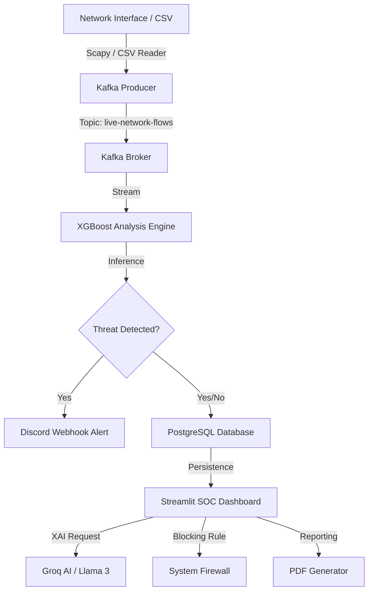

# 🛡️ Enterprise NIDS: Technical Documentation

Welcome to the comprehensive documentation for the **Enterprise-Level Network Intrusion Detection System (NIDS)**. This project is a state-of-the-art security platform that combines real-time packet inspection, machine learning inference, and an interactive SOC (Security Operations Center) dashboard.

---

## 🏗️ System Architecture

The NIDS follows a modern, decoupled architecture designed for high throughput and low latency.



---

## 📂 Component Breakdown

### 1. Data Ingestion & Extraction
*   **`live_sniffer.py`**: Uses **Scapy** to sniff raw packets from the local network interface. It groups packets into bidirectional flows (5-tuples) and calculates 70+ statistical features (e.g., flow duration, packet length variance) matching the CIC-IDS2017 dataset format.
*   **`kafka_producer.py`**: Acts as the gateway. It takes processed flows (either from the sniffer or a CSV file) and streams them into the Kafka cluster for downstream processing.

### 2. Analysis Engine
*   **`spark_consumer.py`**: The "brain" of the system.
    *   **ML Core**: Loads a pre-trained **XGBoost** multiclass classifier (`xgboost_multiclass_realistic.pkl`).
    *   **Inference**: Processes flows in real-time, classifying them as `BENIGN`, `Bot`, `DoS`, `PortScan`, etc.
    *   **Persistence**: Logs every flow into the `alerts` table in PostgreSQL.
    *   **Alerting**: Triggers external webhooks (Discord/Slack) for high-confidence threats (>= 95%).

### 3. SOC Dashboard (`dashboard.py`)
A premium Streamlit-based interface for security analysts:
*   **🏠 Overview**: Real-time metrics and traffic timelines.
*   **🛡️ Threat Intel**: Breakdown of attack types and top offending IPs.
*   **🌍 Global Map**: Visualizes the geographical origin of threats using IP-to-Geo mapping.
*   **🕵️ Forensic Lab (XAI)**: Uses **Groq Cloud (Llama 3)** to provide natural language explanations for model decisions.
*   **📡 Live Tap**: Allows analysts to toggle the live packet sniffer directly from the UI.
*   **⚙️ System Admin**: System health checks, PDF report generation, and Demo/Simulation mode.

### 4. Support Utilities
*   **`preprocess_utils.py`**: Shared logic for cleaning and scaling flow data before ML inference.
*   **`init_db.py`**: Schema initialization for the PostgreSQL database.
*   **`generate_report.py`**: Creates professional PDF summaries using `FPDF`.

---

## 🚀 Getting Started

### Prerequisites
*   **Python 3.10+**
*   **Docker & Docker Compose** (for Kafka and PostgreSQL)
*   **Nmap/Npcap** (Required for Windows packet sniffing)

### Environment Configuration (`.env`)
Create a `.env` file in the root directory with the following variables:
```env
DB_HOST=localhost
DB_NAME=nids_db
DB_USER=nids_user
DB_PASS=nids_password
KAFKA_BROKER=localhost:9092
GROQ_API_KEY=your_groq_api_key
WEBHOOK_URL=your_discord_webhook_url
```

### Installation
1.  **Clone the Repository**
2.  **Install Dependencies**:
    ```bash
    pip install -r requirements.txt
    ```
3.  **Start Infrastructure**:
    ```bash
    docker-compose up -d
    ```
4.  **Initialize Database**:
    ```bash
    python init_db.py
    ```
5.  **Run the Platform**:
    ```bash
    python run_app.py
    ```

> 🔐 **Dashboard Access**: The SOC Dashboard is protected by a password. The default password is `admin123`.

---

## 🧠 Advanced Features

### 1. Explainable AI (XAI)
In the **Forensic Lab**, the system doesn't just say "This is an attack." It sends the flow metadata to **Llama 3 (via Groq)** to generate a tactical assessment, helping analysts understand the *why* behind a detection.

### 2. Active Mitigation
The dashboard includes a one-click **"Block IP"** feature. Depending on your OS, it automatically executes:
*   **Windows**: `netsh advfirewall` rules.
*   **Linux**: `iptables` commands.
This allows for near-instant response to detected threats.

### 3. Global Threat Topology
By integrating with `ip-api.com`, the system resolves the coordinates of attacking IPs and plots them on a 3D PyDeck map, providing immediate situational awareness of global threat actors.

---

## 📊 Database Schema

The `alerts` table in PostgreSQL stores the following telemetry:
| Column | Type | Description |
| :--- | :--- | :--- |
| `id` | SERIAL | Primary Key |
| `timestamp` | TIMESTAMP | Time of detection |
| `source_ip` | VARCHAR(45) | Origin of the flow |
| `dest_ip` | VARCHAR(45) | Target of the flow |
| `attack_type` | VARCHAR(50) | Classified category (e.g., DoS, Bot) |
| `confidence` | FLOAT | Model's confidence score (0-1) |
| `inference_time_ms` | FLOAT | Latency of the ML engine |

---

## 🛠️ Troubleshooting

*   **Kafka Connection Failure**: Ensure the Docker container is healthy (`docker ps`). Check if `KAFKA_BROKER` in `.env` matches your setup.
*   **Permission Denied (Sniffing)**: On Linux, run the sniffer with `sudo`. On Windows, ensure you are running the terminal as Administrator.
*   **Database Error**: Ensure `init_db.py` was run and the credentials in `.env` match `docker-compose.yml`.

---

> **Note**: This system is designed for educational and enterprise-research purposes. Always ensure you have permission to monitor network traffic in your environment.
